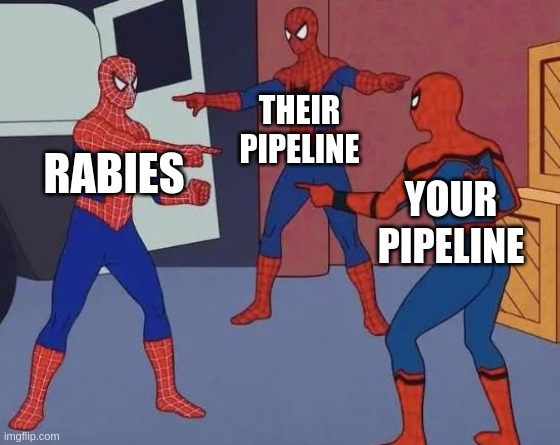

# Welcome to the Multiverse. 
This multicenter project is about evaluating the performance of different rodent functional MRI piplelines using our laterst Multicenter datasets. Everyone is invited to contribute pipelines.  

Why run this? I have been advocating hard for standardize pipelines. We have proposed a protocol for imaging the rat brain that improves the connectivity [outcomes by 50%](https://pubmed.ncbi.nlm.nih.gov/36973511/). This was achieved by using a single pipeline, [RABIES](https://github.com/CoBrALab/RABIE), for data processing. Here we ask how do other pipelines perform? Can we squeeze out more out of our data? Can we identify best practices? 

Expected outcomes: 
- identification of best practices for the preprocessing of the stdrat task-free dataset
- making resource available to reproduce the analysis for the different pipelines
- a publication with all the authors that contributed to the project (yay!!)

## Joining the Multiverse

This study is [pre-registered](https://osf.io/pmdge). Every lab submitting a pipeline can nominate team mates for authorship in the final publication. Authors are listed in alphabetical order, with the exception of the first and last authors who are selected by me.   

I would ask you to preprocess the stdrat task-free rat fMRI dataset "your way" and have it ready in SIGMA (in-vivo) space.

I will then compare a number of features: 
 - motion parameters correlations between pipelines
 - visual QC inspection of EPI -> template registration
 - FC specificity (S1bf-S1vb vs S1bf - ACA)
 - DMN detection (SBA relative to ACA).  

What I will need from you: 
- The fully preprocessed EPI in SIGMA space ready for seed-based analysis.
- The motion parameters (any format)
- A single frame or temporal mean EPI in SIGMA space with original contrast (in case the preprocessed EPI have been demeaned)
- Either the shell script used or a detailed description of each preprocessing step. Including the version for each tool that you used. 
- A list of people to add to the author list (as many as you want), with affiliation, orcid, email, and conflict of interests. 

The link to the dataset to preprocess
https://openneuro.org/datasets/ds004116

The link to SIGMA template for the registration. 
https://zenodo.org/record/7829128

## The results
As of June 18th 2024, we have 4 pipelines submitted: SPM, RABIES, Donders Institute #1 (DI1), and Donders Institute #2 (DI2).

1. Pipeline descriptions [here](pipeline.md)
2. Data exclusion summary [here](exclusion.qmd)
3. Motion parameters correlations between pipelines and frame exclusion (to do)
4. Connectivity specificity analysis (to do)
5. Default mode network detection (to do)

## Extra resources
- RABIES [readthedocs](https://rabies.readthedocs.io/en/latest/)
- RABIES apptainer [containers](https://github.com/CoBrALab/RABIES/releases)
- DI1 and DI2 neurodocker [recipes](https://github.com/grandjeanlab/apptainer/blob/main/neurodocker/neurodocker)
