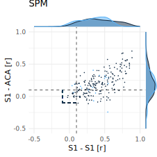
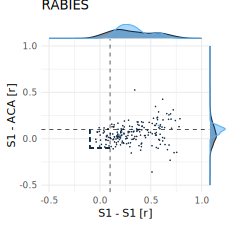
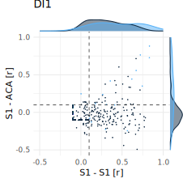
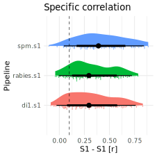
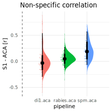

# Pipeline specificity analysis
Joanes Grandjean
2024-06-18

## populate the participants table with the results of the pipeline. Only run once to make the table.

``` r
# write a function that reads a table and returns the specificity of the pipeline
pipeline_specificity <- function(cor_file) {
  cor_tmp <- read_table(cor_file, col_names = FALSE, show_col_types = FALSE)
  s1 <- cor_tmp$X2[1]
  aca <- cor_tmp$X3[2]
  
  if(abs(s1) < 0.1 & abs(aca) < 0.1) {
    return(c("no", s1, aca))
  } else if (s1 > 0.1 & aca < 0.1) {
    return(c("specific", s1, aca))
  } else if (s1 < 0.1 & aca > 0.1) {
    return(c("non-specific", s1, aca))
  } else {
    return(c("spurious", s1, aca))
  }
}


library(tidyverse)

df <- read_tsv("assets/table/participants.tsv") %>% select(participant_id)

# SPM pipeline variables init
df$spm.s1 <- NA
df$spm.aca <- NA
df$spm.specificity <- NA

spm_cor_files <- list.files("/project/4180000.41/data/cas_export/corr", full.names = TRUE)

# RABIES pipeline variables init
df$rabies.s1 <- NA
df$rabies.aca <- NA
df$rabies.specificity <- NA

rabies_cor_files <- list.files("/project/4180000.41/data/rabies_export/corr", full.names = TRUE)

# DI1 pipeline variables init
df$di1.s1 <- NA
df$di1.aca <- NA
df$di1.specificity <- NA

di1_cor_files <- list.files("/project/4180000.41/data/di1_export/corr", full.names = TRUE)


# the big loop that populates the table

for (i in 1:nrow(df)) {
  j<- str_which(spm_cor_files, df$participant_id[i])
  if (length(j) == 1) {
  
  tmp <- pipeline_specificity(spm_cor_files[j])
  df$spm.specificity[i] <- tmp[1]
  df$spm.s1[i] <- tmp[2]
  df$spm.aca[i] <- tmp[3] 
  }

  j<- str_which(rabies_cor_files, df$participant_id[i])
  if (length(j) == 1) {

  tmp <- pipeline_specificity(rabies_cor_files[j])
  df$rabies.specificity[i] <- tmp[1]
  df$rabies.s1[i] <- tmp[2]
  df$rabies.aca[i] <- tmp[3]
  }

  j<- str_which(di1_cor_files, df$participant_id[i])
  if (length(j) == 1) {

  tmp <- pipeline_specificity(di1_cor_files[j])
  df$di1.specificity[i] <- tmp[1]
  df$di1.s1[i] <- tmp[2]
  df$di1.aca[i] <- tmp[3]
  }
}


write_tsv(df, "assets/table/participants_specificity.tsv")
```

## Filter the participants by exclusion criteria and carry out specificity analysis

``` r
library(tidyverse)
```

    -- Attaching core tidyverse packages ------------------------ tidyverse 2.0.0 --
    v dplyr     1.1.4     v readr     2.1.5
    v forcats   1.0.0     v stringr   1.5.1
    v ggplot2   3.5.1     v tibble    3.2.1
    v lubridate 1.9.3     v tidyr     1.3.1
    v purrr     1.0.2     
    -- Conflicts ------------------------------------------ tidyverse_conflicts() --
    x dplyr::filter() masks stats::filter()
    x dplyr::lag()    masks stats::lag()
    i Use the conflicted package (<http://conflicted.r-lib.org/>) to force all conflicts to become errors

``` r
df <- read_tsv("assets/table/participants_specificity.tsv")
```

    Rows: 209 Columns: 10
    -- Column specification --------------------------------------------------------
    Delimiter: "\t"
    chr (4): participant_id, spm.specificity, rabies.specificity, di1.specificity
    dbl (6): spm.s1, spm.aca, rabies.s1, rabies.aca, di1.s1, di1.aca

    i Use `spec()` to retrieve the full column specification for this data.
    i Specify the column types or set `show_col_types = FALSE` to quiet this message.

``` r
df_exclude <- read_tsv("assets/table/participants_exclude.tsv")
```

    Rows: 209 Columns: 5
    -- Column specification --------------------------------------------------------
    Delimiter: "\t"
    chr (1): participant_id
    dbl (4): spm.exclude, rabies.exclude, di1.exclude, global.exclude

    i Use `spec()` to retrieve the full column specification for this data.
    i Specify the column types or set `show_col_types = FALSE` to quiet this message.

``` r
df <- df %>% full_join(df_exclude, by = "participant_id")

# transform the specificity variales into factors
df$spm.specificity <- as.factor(df$spm.specificity)
df$rabies.specificity <- as.factor(df$rabies.specificity)
df$di1.specificity <- as.factor(df$di1.specificity)
```

``` r
# look at specificity without filtering for data exclusion
df %>% select(spm.specificity, rabies.specificity, di1.specificity) %>% summary()
```

         spm.specificity    rabies.specificity     di1.specificity
     no          : 12    no          : 22      no          : 22   
     non-specific:  4    non-specific:  4      non-specific:  7   
     specific    : 55    specific    :111      specific    :131   
     spurious    :136    spurious    : 58      spurious    : 49   
     NA's        :  2    NA's        : 14                         

``` r
# look at specificity after filtering for data exclusion
df %>% filter(global.exclude == 0) %>% select(spm.specificity, rabies.specificity, di1.specificity) %>% summary()
```

         spm.specificity    rabies.specificity     di1.specificity
     no          : 11    no          : 22      no          : 22   
     non-specific:  2    non-specific:  4      non-specific:  6   
     specific    : 51    specific    :109      specific    :123   
     spurious    :126    spurious    : 55      spurious    : 39   

``` r
# are the difference in specificity related to raw functional connectivity between s1?
df %>% filter(global.exclude == 0) %>% select(spm.s1, rabies.s1, di1.s1) %>% summary()
```

         spm.s1          rabies.s1            di1.s1        
     Min.   :-0.1037   Min.   :-0.04058   Min.   :-0.08585  
     1st Qu.: 0.2469   1st Qu.: 0.16797   1st Qu.: 0.13102  
     Median : 0.3970   Median : 0.29373   Median : 0.29047  
     Mean   : 0.4214   Mean   : 0.32754   Mean   : 0.31106  
     3rd Qu.: 0.6058   3rd Qu.: 0.51426   3rd Qu.: 0.47998  
     Max.   : 0.8868   Max.   : 0.78714   Max.   : 0.78341  

``` r
pipeline_specificity_plot <- function(df, x, y, exclude, pipeline) {
  
  library(tidyverse)
  library(ggExtra)

  p <- df %>% filter(!!sym(exclude) == 0) %>%
    ggplot(aes(x = !!sym(x), y = !!sym(y), group = global.exclude, color = global.exclude)) + 
    geom_point(size = 0.1) + 
    geom_vline(xintercept = 0.1, linetype = "dashed", linewidth=0.3) + 
    geom_hline(yintercept = 0.1, linetype = "dashed", linewidth=0.3) + 
    geom_segment(aes(x=-0.1,xend=0.1,y=-0.1,yend=-0.1),linetype = "dashed", linewidth=0.3) + 
    geom_segment(aes(x=-0.1,xend=-0.1,y=0.1,yend=-0.1),linetype = "dashed", linewidth=0.3) + 
    xlim(-0.5, 1) + 
    ylim(-0.5, 1) + 
    theme_minimal() + 
    theme(legend.position = "none") + 
    labs(title = pipeline, x = "S1 - S1 [r]", y = "S1 - ACA [r]") 

  m <- ggMarginal(p, groupColour = TRUE, groupFill = TRUE, size = 10) 

  ggsave(paste0("assets/figures/", pipeline, "_specificity.svg"), plot=m, width = 80, height = 80, unit = 'mm', dpi = 300)
}


pipeline_specificity_plot(df, "spm.s1", "spm.aca", "spm.exclude", "SPM")
pipeline_specificity_plot(df, "rabies.s1", "rabies.aca", "rabies.exclude", "RABIES")
pipeline_specificity_plot(df, "di1.s1", "di1.aca", "di1.exclude", "DI1")
```

    Warning: Removed 1 row containing missing values or values outside the scale range
    (`geom_point()`).
    Removed 1 row containing missing values or values outside the scale range
    (`geom_point()`).

### SPM pipeline specificity outcomes



### RABIES pipeline specificity outcomes



### DI1 pipeline specificity outcomes



``` r
library(ggdist)

# select the s1 colums and global exclude from df and pivot the table
df_s1 <- df %>% select(participant_id, spm.s1, rabies.s1, di1.s1, global.exclude) %>% pivot_longer(cols = c(spm.s1, rabies.s1, di1.s1), names_to = "pipeline", values_to = "s1")

p <- df_s1 %>% ggplot(aes(x = s1, y = pipeline, group = pipeline, fill = pipeline)) + 
  stat_slab(aes(thickness = after_stat(pdf*n)), scale = 0.5) + 
  stat_dotsinterval(side = "bottom", scale = 0.2, slab_linewidth = NA) +
  geom_vline(xintercept = 0.1, linetype = "dashed", linewidth=0.3) + 
  theme_minimal() + 
  theme(legend.position = "none") + 
  labs(title = "Specific correlation", x = "S1 - S1 [r]", y = "Pipeline")

ggsave("assets/figures/s1_correlation.svg", plot=p, width = 80, height = 80, unit = 'mm', dpi = 300)
```

    Warning: Removed 16 rows containing missing values or values outside the scale range
    (`stat_slabinterval()`).
    Removed 16 rows containing missing values or values outside the scale range
    (`stat_slabinterval()`).

### S1 - S1 correlation across pipelines



``` r
# select the aca colums and global exclude from df and pivot the table
df_aca <- df %>% select(participant_id, spm.aca, rabies.aca, di1.aca, global.exclude) %>% pivot_longer(cols = c(spm.aca, rabies.aca, di1.aca), names_to = "pipeline", values_to = "aca")

p <- df_aca %>% ggplot(aes(y = aca, x = pipeline, group = pipeline, fill = pipeline)) + 
  stat_slab(aes(thickness = after_stat(pdf*n)), scale = 0.5) + 
  stat_dotsinterval(side = "bottom", scale = 0.2, slab_linewidth = NA) +
  geom_vline(xintercept = 0.1, linetype = "dashed", linewidth=0.3) + 
  theme_minimal() + 
  theme(legend.position = "none") + 
  labs(title = "Non-specific correlation", x = "pipeline", y = "S1 - ACA [r]")

ggsave("assets/figures/aca_correlation.svg", plot=p, width = 80, height = 80, unit = 'mm', dpi = 300)
```

    Warning: Removed 16 rows containing missing values or values outside the scale range
    (`stat_slabinterval()`).
    Removed 16 rows containing missing values or values outside the scale range
    (`stat_slabinterval()`).

### S1 - ACA correlation across pipelines


