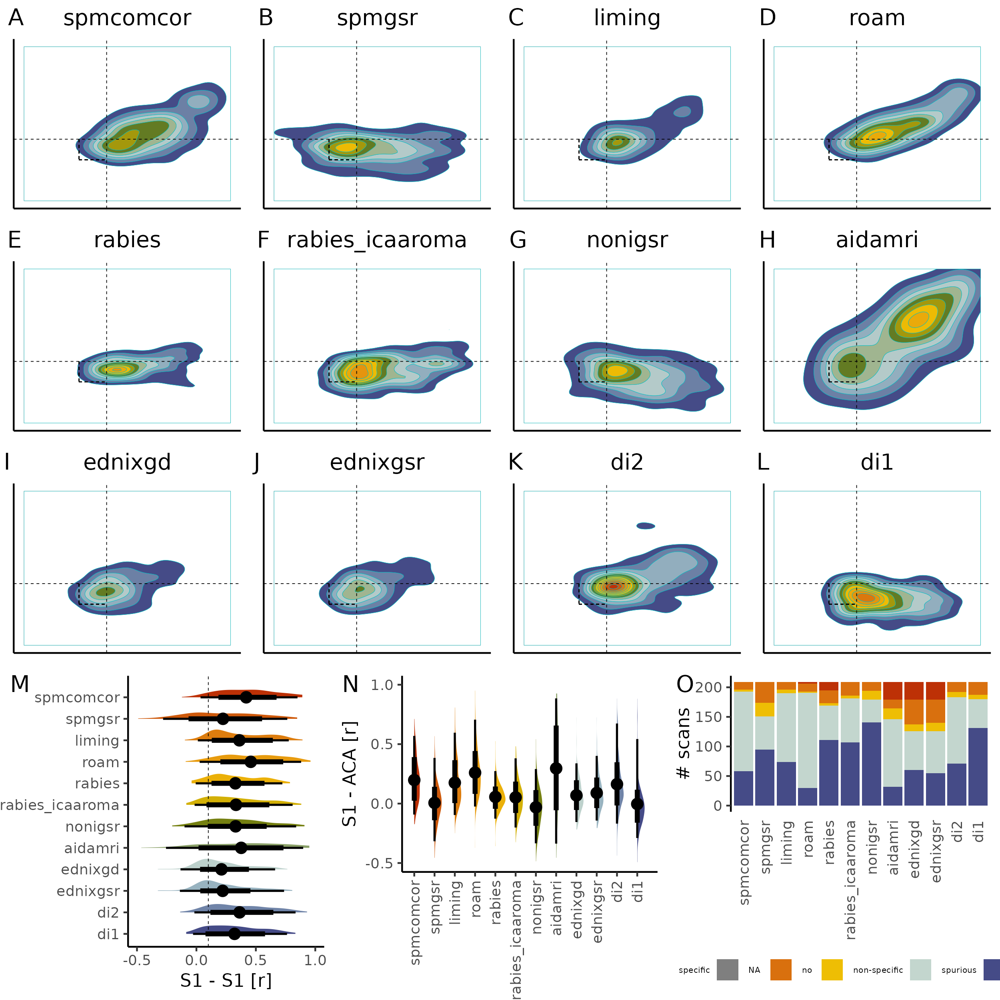

# Pipeline specificity analysis
Joanes Grandjean
2024-06-18

## load the all the libraries used on this notebook and set important variable

``` r
library(tidyverse)
library(ggpubr)
library(ggdist)
library(MetBrewer)

color.scheme <- "VanGogh2"
pipeline_list<-c("spmcomcor", "spmgsr", "liming", "roam", "rabies", "rabies_icaaroma", "nonigsr", "aidamri", "ednixgd","ednixgsr", "di2", "di1" )

met <- met.brewer(color.scheme, length(pipeline_list))
```

## populate the participants table with the results of the pipeline. Only run once to make the table.

``` r
# write a function that reads a table and returns the specificity of the pipeline
pipeline_specificity <- function(cor_file) {
  cor_tmp <- read_table(cor_file, col_names = FALSE, show_col_types = FALSE)
  
#check if cor_tmp is empty and if so, return NA
  if(nrow(cor_tmp) == 0) {
    return(c(NA, NA, NA))
  }

  s1 <- cor_tmp$X2[1]
  aca <- cor_tmp$X3[2]
  
  if(abs(s1) < 0.1 & abs(aca) < 0.1) {
    return(c("no", s1, aca))
  } else if (s1 > 0.1 & aca < 0.1) {
    return(c("specific", s1, aca))
  } else if (s1 < 0.1 & aca > 0.1) {
    return(c("non-specific", s1, aca))
  } else {
    return(c("spurious", s1, aca))
  }
}

#write a function that takes df, a path, and a string. Create columns in df with the specificity of the pipeline 
populate_specificity <- function(df, path, pipeline) {
  cor_files <- list.files(path, full.names = TRUE)
  for (i in 1:nrow(df)) {
    j<- str_which(cor_files, df$participant_id[i])
    if (length(j) == 1) {
      tmp <- pipeline_specificity(cor_files[j])
      df[[paste0(pipeline, ".specificity")]][i] <- tmp[1]
      df[[paste0(pipeline, ".s1")]][i] <- tmp[2]
      df[[paste0(pipeline, ".aca")]][i] <- tmp[3]
    }
    else{
      df[[paste0(pipeline, ".specificity")]][i] <- NA
      df[[paste0(pipeline, ".s1")]][i] <- NA
      df[[paste0(pipeline, ".aca")]][i] <- NA
    }
  }
  return(df)
}

# read the participants table and select the participant_id
df <- read_tsv("assets/table/participants.tsv") %>% select(participant_id)

# populate the table with the specificity of each pipeline
for(i in 1:length(pipeline_list)){
  print(c('processing ',pipeline_list[i]))
  df <- populate_specificity(df, paste0("/project/4180000.41/data/", pipeline_list[i], "_export/corr"), pipeline_list[i])
}

# write the table
write_tsv(df, "assets/table/participants_specificity.tsv")
```

## Filter the participants by exclusion criteria and carry out specificity analysis

``` r
df <- read_tsv("assets/table/participants_specificity.tsv",, show_col_types = FALSE)
df_exclude <- read_tsv("assets/table/participants_exclude.tsv", , show_col_types = FALSE)

df <- df %>% full_join(df_exclude, by = "participant_id")

# for every column in df ending with .specificity, convert the column to a factor
for (i in 2:ncol(df)) {
  if (str_detect(colnames(df)[i], "specificity")) {
    df[[colnames(df)[i]]] <- as.factor(df[[colnames(df)[i]]])
  }
}
```

``` r
# look at specificity without filtering for data exclusion
df %>% select(paste0(pipeline_list,".specificity")) %>% summary()
```

      spmcomcor.specificity    spmgsr.specificity    liming.specificity
     no          : 13       no          :35       no          : 13     
     non-specific:  3       non-specific:23       non-specific:  6     
     specific    : 58       specific    :95       specific    : 74     
     spurious    :135       spurious    :56       spurious    :116     
                                                                       
         roam.specificity    rabies.specificity rabies_icaaroma.specificity
     no          : 13     no          : 22      no          : 23           
     non-specific:  2     non-specific:  4      non-specific:  5           
     specific    : 30     specific    :111      specific    :107           
     spurious    :161     spurious    : 58      spurious    : 74           
     NA's        :  3     NA's        : 14                                 
       nonigsr.specificity   aidamri.specificity   ednixgd.specificity
     no          : 15      no          : 15      no          :42      
     non-specific: 15      non-specific: 18      non-specific:11      
     specific    :141      specific    : 32      specific    :60      
     spurious    : 38      spurious    :114      spurious    :66      
                           NA's        : 30      NA's        :30      
       ednixgsr.specificity     di2.specificity     di1.specificity
     no          :39        no          : 17    no          : 22   
     non-specific:14        non-specific:  9    non-specific:  7   
     specific    :55        specific    : 71    specific    :131   
     spurious    :71        spurious    :112    spurious    : 49   
     NA's        :30                                               

``` r
# look at specificity after filtering for data exclusion
df %>% filter(global.exclude == 1) %>% select(paste0(pipeline_list,".specificity")) %>% summary()
```

      spmcomcor.specificity    spmgsr.specificity    liming.specificity
     no          :10        no          :30       no          :11      
     non-specific: 2        non-specific:17       non-specific: 5      
     specific    :45        specific    :61       specific    :58      
     spurious    :85        spurious    :34       spurious    :68      
         roam.specificity    rabies.specificity rabies_icaaroma.specificity
     no          : 12     no          :19       no          :19            
     non-specific:  2     non-specific: 2       non-specific: 4            
     specific    : 26     specific    :81       specific    :78            
     spurious    :102     spurious    :40       spurious    :41            
       nonigsr.specificity   aidamri.specificity   ednixgd.specificity
     no          :12       no          :11       no          :32      
     non-specific:10       non-specific:12       non-specific: 8      
     specific    :99       specific    :24       specific    :50      
     spurious    :21       spurious    :95       spurious    :52      
       ednixgsr.specificity     di2.specificity     di1.specificity
     no          :29        no          :12     no          :19    
     non-specific:11        non-specific: 8     non-specific: 6    
     specific    :46        specific    :53     specific    :96    
     spurious    :56        spurious    :69     spurious    :21    

``` r
# are the difference in specificity related to raw functional connectivity between s1?
df %>% filter(global.exclude == 1) %>% select(paste0(pipeline_list,".s1")) %>% summary()
```

      spmcomcor.s1       spmgsr.s1           liming.s1           roam.s1        
     Min.   :-0.1221   Min.   :-0.647920   Min.   :-0.09722   Min.   :-0.09044  
     1st Qu.: 0.2232   1st Qu.:-0.001455   1st Qu.: 0.13732   1st Qu.: 0.20802  
     Median : 0.3788   Median : 0.182850   Median : 0.25221   Median : 0.37561  
     Mean   : 0.4086   Mean   : 0.213455   Mean   : 0.32895   Mean   : 0.41712  
     3rd Qu.: 0.5679   3rd Qu.: 0.459160   3rd Qu.: 0.50229   3rd Qu.: 0.60456  
     Max.   : 0.8908   Max.   : 0.847670   Max.   : 0.85363   Max.   : 0.90118  
       rabies.s1        rabies_icaaroma.s1   nonigsr.s1        aidamri.s1     
     Min.   :-0.04058   Min.   :-0.08497   Min.   :-0.2038   Min.   :-0.5490  
     1st Qu.: 0.14436   1st Qu.: 0.11589   1st Qu.: 0.1169   1st Qu.: 0.1471  
     Median : 0.25598   Median : 0.25104   Median : 0.3035   Median : 0.4526  
     Mean   : 0.31387   Mean   : 0.31475   Mean   : 0.3234   Mean   : 0.4019  
     3rd Qu.: 0.48345   3rd Qu.: 0.48742   3rd Qu.: 0.5001   3rd Qu.: 0.6544  
     Max.   : 0.78714   Max.   : 0.88238   Max.   : 0.9092   Max.   : 0.9322  
       ednixgd.s1        ednixgsr.s1           di2.s1            di1.s1        
     Min.   :-0.32429   Min.   :-0.32431   Min.   :-0.1368   Min.   :-0.05325  
     1st Qu.: 0.05155   1st Qu.: 0.05419   1st Qu.: 0.1398   1st Qu.: 0.09209  
     Median : 0.16078   Median : 0.16516   Median : 0.2628   Median : 0.23674  
     Mean   : 0.20835   Mean   : 0.21663   Mean   : 0.3407   Mean   : 0.28869  
     3rd Qu.: 0.32067   3rd Qu.: 0.32193   3rd Qu.: 0.5266   3rd Qu.: 0.44665  
     Max.   : 0.76522   Max.   : 0.80617   Max.   : 0.9307   Max.   : 0.78341  

``` r
# are the difference in specificity related to raw functional connectivity between s1 and aca?
df %>% filter(global.exclude == 1) %>% select(paste0(pipeline_list,".aca")) %>% summary()
```

     spmcomcor.aca        spmgsr.aca          liming.aca          roam.aca      
     Min.   :-0.09968   Min.   :-0.431070   Min.   :-0.13459   Min.   :-0.3728  
     1st Qu.: 0.05026   1st Qu.:-0.074277   1st Qu.: 0.02658   1st Qu.: 0.0946  
     Median : 0.16601   Median : 0.015860   Median : 0.10784   Median : 0.1975  
     Mean   : 0.18161   Mean   : 0.003104   Mean   : 0.14294   Mean   : 0.2188  
     3rd Qu.: 0.28302   3rd Qu.: 0.093143   3rd Qu.: 0.22350   3rd Qu.: 0.3134  
     Max.   : 0.71206   Max.   : 0.420410   Max.   : 0.71030   Max.   : 0.6545  
       rabies.aca        rabies_icaaroma.aca  nonigsr.aca        aidamri.aca      
     Min.   :-0.231540   Min.   :-0.32522    Min.   :-0.37231   Min.   :-0.56416  
     1st Qu.:-0.008055   1st Qu.:-0.05879    1st Qu.:-0.14632   1st Qu.: 0.06402  
     Median : 0.039030   Median : 0.01939    Median :-0.04098   Median : 0.32828  
     Mean   : 0.052802   Mean   : 0.02959    Mean   :-0.03624   Mean   : 0.30225  
     3rd Qu.: 0.111708   3rd Qu.: 0.09592    3rd Qu.: 0.05330   3rd Qu.: 0.55180  
     Max.   : 0.525460   Max.   : 0.47317    Max.   : 0.35150   Max.   : 0.92381  
      ednixgd.aca        ednixgsr.aca         di2.aca            di1.aca        
     Min.   :-0.21802   Min.   :-0.20608   Min.   :-0.53003   Min.   :-0.59714  
     1st Qu.:-0.03600   1st Qu.:-0.02359   1st Qu.: 0.03722   1st Qu.:-0.14276  
     Median : 0.04361   Median : 0.06132   Median : 0.10995   Median :-0.04899  
     Mean   : 0.05469   Mean   : 0.07554   Mean   : 0.13622   Mean   :-0.06119  
     3rd Qu.: 0.15239   3rd Qu.: 0.16074   3rd Qu.: 0.21805   3rd Qu.: 0.01980  
     Max.   : 0.51500   Max.   : 0.51031   Max.   : 0.76025   Max.   : 0.37511  

## this section plots pipeline specificity for each pipeline

``` r
pipeline_specificity_plot <- function(df, x, y, exclude, pipeline, met){
  
  library(tidyverse)
#  library(ggExtra)

  p <- df %>% filter(!!sym(exclude) != 0) %>%
    ggplot(aes(x = !!sym(x), 
               y = !!sym(y), 
               color = as.factor(global.exclude))) + 
   # geom_point(size = 0.1) + 
    geom_density_2d_filled(linewidth = 0.1) +
    geom_vline(xintercept = 0.1, linetype = "dashed", linewidth=0.2) + 
    geom_hline(yintercept = 0.1, linetype = "dashed", linewidth=0.2) + 
    geom_segment(aes(x=-0.1,xend=0.1,y=-0.1,yend=-0.1),linetype = "dashed", linewidth=0.2, colour='black') + 
    geom_segment(aes(x=-0.1,xend=-0.1,y=0.1,yend=-0.1),linetype = "dashed", linewidth=0.2, colour='black') + 
    xlim(-0.5, 1) + 
    ylim(-0.5, 1) + 
    #labs(title = pipeline, x = "S1 - S1 [r]", y = "S1 - ACA [r]") +
    #scale_color_manual(values = c("darkgrey", met)) +
    scale_fill_manual(values=c("white", met.brewer(color.scheme, 13)[13:1])) +
    theme_classic() +
    labs(title = pipeline) +
    theme(legend.position = "none", axis.text =element_blank(), axis.title = element_blank(), axis.ticks = element_blank(), plot.title = element_text(hjust = 0.5))  

  #m <- ggMarginal(p, fill = met, color = NaN, size = 10) 

  return(p)
}

#write a loop that creates a plot for each pipeline based on an array of strings containing the pipeline names.

for(i in 1:length(pipeline_list)){
  assign(paste0(pipeline_list[i], "_spec"), pipeline_specificity_plot(df, paste0(pipeline_list[i], ".s1"), paste0(pipeline_list[i], ".aca"), paste0(pipeline_list[i], ".exclude"), pipeline_list[i], met[i]))
}

combine_spec <- ggarrange(plotlist=mget(paste0(pipeline_list,"_spec")), labels = LETTERS[1:length(pipeline_list)])

#make a tmp save of the plot
ggsave("assets/tmp/specificity.png",plot=combine_spec, height=2000, width=2000, units='px')
```

## this section plots S1 - S1 correlations across pipelines

``` r
# select the s1 colums and global exclude from df and pivot the table
df_s1 <- df %>% select(paste0(pipeline_list,".s1"),participant_id,  global.exclude) %>% pivot_longer(cols = paste0(pipeline_list,".s1"), names_to = "pipeline", values_to = "s1")

# rename the pipelines to remove the .s1 and capitalize all
df_s1$pipeline <- str_remove(df_s1$pipeline, ".s1")

#convert the pipeline to a factor and order it according to inverse of pipeline_list
df_s1$pipeline <- factor(df_s1$pipeline, levels = rev(pipeline_list))

s1_plot <- df_s1 %>% ggplot(aes(x = s1, y = pipeline, group = pipeline, fill = pipeline)) + 
  stat_slab(aes(thickness = after_stat(pdf*n)), scale = 0.5) + 
  stat_pointinterval(scale = 0.2, slab_linewidth = NA, point_interval = mean_qi) +
  geom_vline(xintercept = 0.1, linetype = "dashed", linewidth=0.2) +
  scale_fill_manual(values = rev(met)) +
  xlim(-0.5, 1) +
  theme_classic() + 
  theme(legend.position = "none", axis.title.y=element_blank()) +
  labs(x = "S1 - S1 [r]", y = "Pipeline")
```

## this section plots S1 - ACA correlation across pipelines

``` r
# select the aca colums and global exclude from df and pivot the table
df_aca <- df %>% select(paste0(pipeline_list,".aca"),participant_id,  global.exclude) %>% pivot_longer(cols = paste0(pipeline_list,".aca"), names_to = "pipeline", values_to = "aca")

# rename the pipelines to remove the .aca and capitalize all
df_aca$pipeline <- str_remove(df_aca$pipeline, ".aca")

#convert the pipeline to a factor and order it according to inverse of pipeline_list
df_aca$pipeline <- factor(df_aca$pipeline, levels = pipeline_list)

aca_plot <- df_aca %>% ggplot(aes(y = aca, x = pipeline, group = pipeline, fill = pipeline)) + 
  stat_slab(aes(thickness = after_stat(pdf*n)), scale = 0.5) + 
  stat_pointinterval(scale = 0.2, slab_linewidth = NA, point_interval = mean_qi) +
  geom_vline(xintercept = 0.1, linetype = "dashed", linewidth=0.2) +
  scale_fill_manual(values = met) +
  ylim(-0.5, 1) +
  theme_classic() + 
  theme(legend.position = "none", axis.title.x = element_blank(), axis.text.x = element_text(angle = 90, hjust = 1, vjust = 0.5,)) + 
  labs(y = "S1 - ACA [r]") 
```

``` r
# select the specificity colums from df and pivot the table
df_spec <- df %>% select(participant_id, paste0(pipeline_list,".specificity")) %>%  
  pivot_longer(cols = paste0(pipeline_list,".specificity"), names_to = "pipeline", values_to = "specific")

df_spec$pipeline <- str_remove(df_spec$pipeline, ".specificity")

df_spec$pipeline <- factor(df_spec$pipeline, levels = pipeline_list)


df_spec$specific <- factor(df_spec$specific, levels = c(NA,"no", "non-specific", "spurious","specific"), exclude = NULL)

summary_plot <- df_spec %>% ggplot(aes(x = pipeline,  
                       group = specific, 
                       fill = specific)) + 
  geom_bar() +
scale_fill_manual(values = met.brewer("VanGogh2",5)) +
  theme_classic() + 
  theme( legend.position = "bottom",
        legend.text = element_text(size=5),
        legend.title = element_text(size=5),
        legend.key.size = unit(5, units = "mm"),
        axis.title.x = element_blank(), 
        axis.line.x = element_blank(), 
        axis.ticks.x = element_blank(), 
        axis.text.x = element_text(angle = 90, hjust = 1, vjust = 0.5)) +
  labs(y = "# scans") 
```

## puts all the figures together

``` r
combine_misc <- ggarrange(s1_plot, aca_plot, summary_plot, labels = LETTERS[length(pipeline_list)+1:+3], ncol = 3, nrow = 1)

combine_plot <- ggarrange(combine_spec, combine_misc , ncol = 1, nrow = 2, heights = c(1, 0.5))

ggsave("assets/figures/pipeline_specificity.svg", plot=combine_plot, width = 300, height = 300, unit = 'mm', dpi = 500)
ggsave("assets/figures/pipeline_specificity.png", plot=combine_plot, width = 2500, height = 2500, unit = 'px')
```


