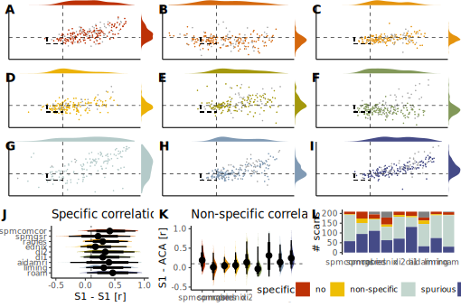

# Pipeline specificity analysis
Joanes Grandjean
2024-06-18

## load the all the libraries used on this notebook and set important variable

``` r
library(tidyverse)
library(ggpubr)
library(ggdist)
library(MetBrewer)

color.scheme <- "VanGogh2"
pipeline_list<-c("spmcomcor", "spmgsr", "rabies", "easymribrain", "di2", "di1", "aidamri", "liming", "russo")

met <- met.brewer(color.scheme, length(pipeline_list))
```

## populate the participants table with the results of the pipeline. Only run once to make the table.

``` r
# write a function that reads a table and returns the specificity of the pipeline
pipeline_specificity <- function(cor_file) {
  cor_tmp <- read_table(cor_file, col_names = FALSE, show_col_types = FALSE)
  
#check if cor_tmp is empty and if so, return NA
  if(nrow(cor_tmp) == 0) {
    return(c(NA, NA, NA))
  }

  s1 <- cor_tmp$X2[1]
  aca <- cor_tmp$X3[2]
  
  if(abs(s1) < 0.1 & abs(aca) < 0.1) {
    return(c("no", s1, aca))
  } else if (s1 > 0.1 & aca < 0.1) {
    return(c("specific", s1, aca))
  } else if (s1 < 0.1 & aca > 0.1) {
    return(c("non-specific", s1, aca))
  } else {
    return(c("spurious", s1, aca))
  }
}

#write a function that takes df, a path, and a string. Create columns in df with the specificity of the pipeline 
populate_specificity <- function(df, path, pipeline) {
  cor_files <- list.files(path, full.names = TRUE)
  for (i in 1:nrow(df)) {
    j<- str_which(cor_files, df$participant_id[i])
    if (length(j) == 1) {
      tmp <- pipeline_specificity(cor_files[j])
      df[[paste0(pipeline, ".specificity")]][i] <- tmp[1]
      df[[paste0(pipeline, ".s1")]][i] <- tmp[2]
      df[[paste0(pipeline, ".aca")]][i] <- tmp[3]
    }
    else{
      df[[paste0(pipeline, ".specificity")]][i] <- NA
      df[[paste0(pipeline, ".s1")]][i] <- NA
      df[[paste0(pipeline, ".aca")]][i] <- NA
    }
  }
  return(df)
}

# read the participants table and select the participant_id
df <- read_tsv("assets/table/participants.tsv") %>% select(participant_id)

# populate the table with the specificity of each pipeline
for(i in 1:length(pipeline_list)){
  print(c('processing ',pipeline_list[i]))
  df <- populate_specificity(df, paste0("/project/4180000.41/data/", pipeline_list[i], "_export/corr"), pipeline_list[i])
}

# write the table
write_tsv(df, "assets/table/participants_specificity.tsv")
```

## Filter the participants by exclusion criteria and carry out specificity analysis

``` r
df <- read_tsv("assets/table/participants_specificity.tsv",, show_col_types = FALSE)
df_exclude <- read_tsv("assets/table/participants_exclude.tsv", , show_col_types = FALSE)

df <- df %>% full_join(df_exclude, by = "participant_id")

# for every column in df ending with .specificity, convert the column to a factor
for (i in 2:ncol(df)) {
  if (str_detect(colnames(df)[i], "specificity")) {
    df[[colnames(df)[i]]] <- as.factor(df[[colnames(df)[i]]])
  }
}
```

``` r
# look at specificity without filtering for data exclusion
df %>% select(paste0(pipeline_list,".specificity")) %>% summary()
```

      spmcomcor.specificity    spmgsr.specificity    rabies.specificity
     no          : 13       no          :35       no          : 22     
     non-specific:  3       non-specific:23       non-specific:  4     
     specific    : 58       specific    :95       specific    :111     
     spurious    :135       spurious    :56       spurious    : 58     
                                                  NA's        : 14     
     easymribrain.specificity     di2.specificity     di1.specificity
     no          :29          no          : 17    no          : 22   
     non-specific:11          non-specific:  9    non-specific:  7   
     specific    :78          specific    : 71    specific    :131   
     spurious    :89          spurious    :112    spurious    : 49   
     NA's        : 2                                                 
       aidamri.specificity    liming.specificity    russo.specificity
     no          : 15      no          : 13      no          : 13    
     non-specific: 18      non-specific:  6      non-specific:  2    
     specific    : 32      specific    : 74      specific    : 30    
     spurious    :114      spurious    :116      spurious    :161    
     NA's        : 30                            NA's        :  3    

``` r
# look at specificity after filtering for data exclusion
df %>% filter(global.exclude == 1) %>% select(paste0(pipeline_list,".specificity")) %>% summary()
```

      spmcomcor.specificity    spmgsr.specificity    rabies.specificity
     no          :10        no          :30       no          :19      
     non-specific: 2        non-specific:17       non-specific: 2      
     specific    :46        specific    :62       specific    :82      
     spurious    :86        spurious    :35       spurious    :41      
                                                                       
     easymribrain.specificity     di2.specificity     di1.specificity
     no          :22          no          :12     no          :19    
     non-specific: 5          non-specific: 8     non-specific: 6    
     specific    :57          specific    :54     specific    :97    
     spurious    :59          spurious    :70     spurious    :22    
     NA's        : 1                                                 
       aidamri.specificity    liming.specificity    russo.specificity
     no          :11       no          :10       no          : 12    
     non-specific:12       non-specific: 5       non-specific:  2    
     specific    :25       specific    :59       specific    : 26    
     spurious    :95       spurious    :70       spurious    :104    
     NA's        : 1                                                 

``` r
# are the difference in specificity related to raw functional connectivity between s1?
df %>% filter(global.exclude == 1) %>% select(paste0(pipeline_list,".s1")) %>% summary()
```

      spmcomcor.s1       spmgsr.s1           rabies.s1        easymribrain.s1   
     Min.   :-0.1221   Min.   :-0.647920   Min.   :-0.04058   Min.   :-0.17283  
     1st Qu.: 0.2229   1st Qu.:-0.007508   1st Qu.: 0.14441   1st Qu.: 0.08349  
     Median : 0.3816   Median : 0.182850   Median : 0.26203   Median : 0.20204  
     Mean   : 0.4102   Mean   : 0.208821   Mean   : 0.31659   Mean   : 0.24291  
     3rd Qu.: 0.5691   3rd Qu.: 0.458940   3rd Qu.: 0.48827   3rd Qu.: 0.36037  
     Max.   : 0.8908   Max.   : 0.847670   Max.   : 0.78714   Max.   : 0.88179  
                                                              NA's   :1         
         di2.s1            di1.s1           aidamri.s1        liming.s1       
     Min.   :-0.1368   Min.   :-0.05325   Min.   :-0.5490   Min.   :-0.09722  
     1st Qu.: 0.1417   1st Qu.: 0.09226   1st Qu.: 0.1492   1st Qu.: 0.14322  
     Median : 0.2648   Median : 0.24470   Median : 0.4542   Median : 0.25545  
     Mean   : 0.3448   Mean   : 0.29250   Mean   : 0.4053   Mean   : 0.33483  
     3rd Qu.: 0.5303   3rd Qu.: 0.46134   3rd Qu.: 0.6580   3rd Qu.: 0.51140  
     Max.   : 0.9307   Max.   : 0.78341   Max.   : 0.9322   Max.   : 0.85363  
                                          NA's   :1                           
        russo.s1       
     Min.   :-0.09044  
     1st Qu.: 0.20945  
     Median : 0.38896  
     Mean   : 0.42350  
     3rd Qu.: 0.61492  
     Max.   : 0.90118  
                       

``` r
# are the difference in specificity related to raw functional connectivity between s1 and aca?
df %>% filter(global.exclude == 1) %>% select(paste0(pipeline_list,".aca")) %>% summary()
```

     spmcomcor.aca        spmgsr.aca          rabies.aca        easymribrain.aca   
     Min.   :-0.09968   Min.   :-0.431070   Min.   :-0.231540   Min.   :-0.323180  
     1st Qu.: 0.05131   1st Qu.:-0.074843   1st Qu.:-0.007405   1st Qu.:-0.006095  
     Median : 0.16939   Median : 0.015125   Median : 0.039030   Median : 0.053530  
     Mean   : 0.18203   Mean   : 0.003056   Mean   : 0.053919   Mean   : 0.068808  
     3rd Qu.: 0.28670   3rd Qu.: 0.089408   3rd Qu.: 0.113842   3rd Qu.: 0.154970  
     Max.   : 0.71206   Max.   : 0.420410   Max.   : 0.525460   Max.   : 0.512050  
                                                                NA's   :1          
        di2.aca            di1.aca          aidamri.aca         liming.aca      
     Min.   :-0.53003   Min.   :-0.59714   Min.   :-0.56416   Min.   :-0.13459  
     1st Qu.: 0.03585   1st Qu.:-0.14105   1st Qu.: 0.04284   1st Qu.: 0.03194  
     Median : 0.10995   Median :-0.04777   Median : 0.32475   Median : 0.11007  
     Mean   : 0.13719   Mean   :-0.05676   Mean   : 0.30253   Mean   : 0.14842  
     3rd Qu.: 0.23528   3rd Qu.: 0.02131   3rd Qu.: 0.55332   3rd Qu.: 0.23508  
     Max.   : 0.76025   Max.   : 0.37626   Max.   : 0.92606   Max.   : 0.71030  
                                           NA's   :1                            
       russo.aca       
     Min.   :-0.37282  
     1st Qu.: 0.09581  
     Median : 0.20298  
     Mean   : 0.22297  
     3rd Qu.: 0.33408  
     Max.   : 0.65455  
                       

## this section plots pipeline specificity for each pipeline

``` r
pipeline_specificity_plot <- function(df, x, y, exclude, pipeline, met){
  
  library(tidyverse)
  library(ggExtra)

  p <- df %>% filter(!!sym(exclude) != 0) %>%
    ggplot(aes(x = !!sym(x), 
               y = !!sym(y), 
               color = as.factor(global.exclude))) + 
    geom_point(size = 0.1) + 
    geom_vline(xintercept = 0.1, linetype = "dashed", linewidth=0.3) + 
    geom_hline(yintercept = 0.1, linetype = "dashed", linewidth=0.3) + 
    geom_segment(aes(x=-0.1,xend=0.1,y=-0.1,yend=-0.1),linetype = "dashed", linewidth=0.3, colour='black') + 
    geom_segment(aes(x=-0.1,xend=-0.1,y=0.1,yend=-0.1),linetype = "dashed", linewidth=0.3, colour='black') + 
    xlim(-0.5, 1) + 
    ylim(-0.5, 1) + 
    #labs(title = pipeline, x = "S1 - S1 [r]", y = "S1 - ACA [r]") +
    scale_color_manual(values = c("darkgrey", met)) +
    theme_classic() +
    theme(legend.position = "none", axis.text =element_blank(), axis.title = element_blank(), axis.ticks = element_blank()) 

  m <- ggMarginal(p, fill = met, color = NaN, size = 10) 

  return(m)
}

#write a loop that creates a plot for each pipeline based on an array of strings containing the pipeline names.

for(i in 1:length(pipeline_list)){
  assign(paste0(pipeline_list[i], "_spec"), pipeline_specificity_plot(df, paste0(pipeline_list[i], ".s1"), paste0(pipeline_list[i], ".aca"), paste0(pipeline_list[i], ".exclude"), pipeline_list[i], met[i]))
}

combine_spec <- ggarrange(plotlist=mget(paste0(pipeline_list,"_spec")), labels = LETTERS[1:length(pipeline_list)])

#make a tmp save of the plot
ggsave("assets/tmp/specificity.png",plot=combine_spec, height=2000, width=2000, units='px')
```

## this section plots S1 - S1 correlations across pipelines

``` r
# select the s1 colums and global exclude from df and pivot the table
df_s1 <- df %>% select(paste0(pipeline_list,".s1"),participant_id,  global.exclude) %>% pivot_longer(cols = paste0(pipeline_list,".s1"), names_to = "pipeline", values_to = "s1")

# rename the pipelines to remove the .s1 and capitalize all
df_s1$pipeline <- str_remove(df_s1$pipeline, ".s1")

#convert the pipeline to a factor and order it according to inverse of pipeline_list
df_s1$pipeline <- factor(df_s1$pipeline, levels = rev(pipeline_list))

s1_plot <- df_s1 %>% ggplot(aes(x = s1, y = pipeline, group = pipeline, fill = pipeline)) + 
  stat_slab(aes(thickness = after_stat(pdf*n)), scale = 0.5) + 
  stat_dotsinterval(side = "bottom", scale = 0.2, slab_linewidth = NA) +
  geom_vline(xintercept = 0.1, linetype = "dashed", linewidth=0.3) +
  scale_fill_manual(values = rev(met)) +
  xlim(-0.5, 1) +
  theme_classic() + 
  theme(legend.position = "none", axis.title.y=element_blank()) +
  labs(title = "Specific correlation", x = "S1 - S1 [r]", y = "Pipeline")
```

## this section plots S1 - ACA correlation across pipelines

``` r
# select the aca colums and global exclude from df and pivot the table
df_aca <- df %>% select(paste0(pipeline_list,".aca"),participant_id,  global.exclude) %>% pivot_longer(cols = paste0(pipeline_list,".aca"), names_to = "pipeline", values_to = "aca")

# rename the pipelines to remove the .aca and capitalize all
df_aca$pipeline <- str_remove(df_aca$pipeline, ".aca")

#convert the pipeline to a factor and order it according to inverse of pipeline_list
df_aca$pipeline <- factor(df_aca$pipeline, levels = pipeline_list)

aca_plot <- df_aca %>% ggplot(aes(y = aca, x = pipeline, group = pipeline, fill = pipeline)) + 
  stat_slab(aes(thickness = after_stat(pdf*n)), scale = 0.5) + 
  stat_dotsinterval(side = "bottom", scale = 0.2, slab_linewidth = NA) +
  geom_hline(yintercept = 0.1, linetype = "dashed", linewidth=0.3) + 
  scale_fill_manual(values = met) +
  ylim(-0.5, 1) +
  theme_classic() + 
  theme(legend.position = "none", axis.title.x = element_blank()) + 
  labs(title = "Non-specific correlation", y = "S1 - ACA [r]") 
```

``` r
# select the specificity colums from df and pivot the table
df_spec <- df %>% select(participant_id, paste0(pipeline_list,".specificity")) %>%  
  pivot_longer(cols = paste0(pipeline_list,".specificity"), names_to = "pipeline", values_to = "specific")

df_spec$pipeline <- str_remove(df_spec$pipeline, ".specificity")

df_spec$pipeline <- factor(df_spec$pipeline, levels = pipeline_list)


df_spec$specific <- factor(df_spec$specific, levels = c(NA,"no", "non-specific", "spurious","specific"), exclude = NULL)

summary_plot <- df_spec %>% ggplot(aes(x = pipeline,  
                       group = specific, 
                       fill = specific)) + 
  geom_bar() +
scale_fill_manual(values = met.brewer("VanGogh2",4)) +
  theme_classic() + 
  theme(legend.position = "none", 
        axis.title.x = element_blank(), 
        axis.line.x = element_blank(), 
        axis.ticks.x = element_blank()) +
  labs(y = "# scans") 
```

## puts all the figures together

``` r
combine_misc <- ggarrange(s1_plot, aca_plot, summary_plot, labels = LETTERS[length(pipeline_list)+1:+3], ncol = 3, nrow = 1)

combine_plot <- ggarrange(combine_spec, combine_misc , ncol = 1, nrow = 2, heights = c(1, 0.5))

ggsave("assets/figures/pipeline_specificity.svg", plot=combine_plot, width = 180, height = 120, unit = 'mm', dpi = 300)
```


