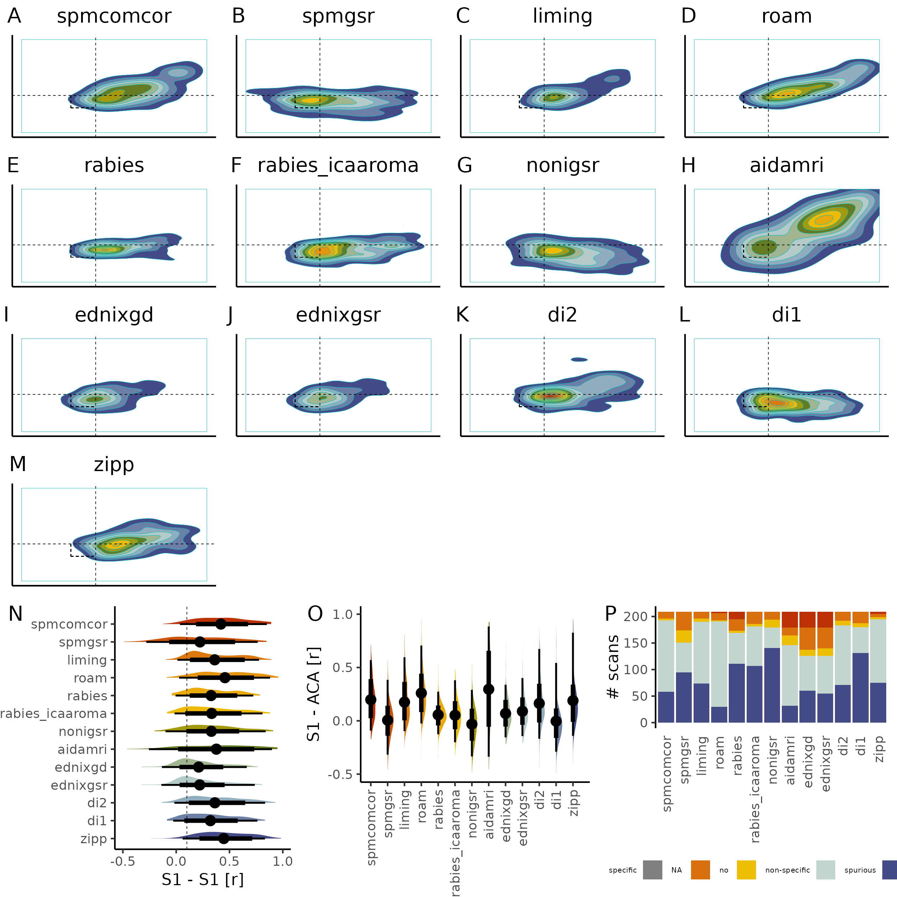

## load the all the libraries used on this notebook and set important variable
```{r}
#| eval = FALSE

#import config.r, this contains variables and re-usable functions
source("config.r")


# read the participants table and select the participant_id
df <- read_tsv("assets/table/participants.tsv") %>% select(participant_id)

# populate the table with the specificity of each pipeline
for(i in 1:length(pipeline_list)){
  print(c('processing ',pipeline_list[i]))
  df <- populate_specificity(df, paste0("/project/4180000.41/data/", pipeline_list[i], "_export/corr"), pipeline_list[i])
}

# write the table
write_tsv(df, "assets/table/participants_specificity.tsv")

```

## Filter the participants by exclusion criteria and carry out specificity analysis

```{r}

df <- read_tsv("assets/table/participants_specificity.tsv",, show_col_types = FALSE)
df_exclude <- read_tsv("assets/table/participants_exclude.tsv", , show_col_types = FALSE)

df <- df %>% full_join(df_exclude, by = "participant_id")

# for every column in df ending with .specificity, convert the column to a factor
for (i in 2:ncol(df)) {
  if (str_detect(colnames(df)[i], "specificity")) {
    df[[colnames(df)[i]]] <- as.factor(df[[colnames(df)[i]]])
  }
}

```

```{r}
# look at specificity without filtering for data exclusion
df %>% select(paste0(pipeline_list,".specificity")) %>% summary()
```

```{r}
# look at specificity after filtering for data exclusion
df %>% filter(global.exclude == 1) %>% select(paste0(pipeline_list,".specificity")) %>% summary()

```

```{r}
# are the difference in specificity related to raw functional connectivity between s1?
df %>% filter(global.exclude == 1) %>% select(paste0(pipeline_list,".s1")) %>% summary()

``` 

```{r}
# are the difference in specificity related to raw functional connectivity between s1 and aca?
df %>% filter(global.exclude == 1) %>% select(paste0(pipeline_list,".aca")) %>% summary()

``` 


## this section plots pipeline specificity for each pipeline
```{r}
#| eval = FALSE

pipeline_specificity_plot <- function(df, pipeline){
  
  library(tidyverse)
#  library(ggExtra)

  p <- df %>% rename_with(~ str_replace(., paste0(pipeline, "."), "default."), starts_with(pipeline)) %>%
    filter(default.exclude != 0) %>%
    ggplot(aes(x = default.s1, 
               y = default.aca)) + 
    geom_density_2d_filled(linewidth = 0.1) +
    geom_vline(xintercept = 0.1, linetype = "dashed", linewidth=0.2) + 
    geom_hline(yintercept = 0.1, linetype = "dashed", linewidth=0.2) + 
    geom_segment(aes(x=-0.1,xend=0.1,y=-0.1,yend=-0.1),linetype = "dashed", linewidth=0.2, colour='black') + 
    geom_segment(aes(x=-0.1,xend=-0.1,y=0.1,yend=-0.1),linetype = "dashed", linewidth=0.2, colour='black') + 
    xlim(-0.5, 1) + 
    ylim(-0.5, 1) + 
    scale_fill_manual(values=c("white", met.brewer(color.scheme, 13)[13:1])) +
    theme_classic() +
    labs(title = pipeline) +
    theme(legend.position = "none", axis.text =element_blank(), axis.title = element_blank(), axis.ticks = element_blank(), plot.title = element_text(hjust = 0.5))  

  return(p)
}

#write a loop that creates a plot for each pipeline based on an array of strings containing the pipeline names.

for(i in 1:length(pipeline_list)){
  assign(paste0(pipeline_list[i], "_spec"), pipeline_specificity_plot(df, paste0(pipeline_list[i])))
}

combine_spec <- ggarrange(plotlist=mget(paste0(pipeline_list,"_spec")), labels = LETTERS[1:length(pipeline_list)])

#make a tmp save of the plot
ggsave("assets/tmp/specificity.png",plot=combine_spec, height=2000, width=2000, units='px')

```

## this section plots S1 - S1 correlations across pipelines
```{r}
#| eval = FALSE

# select the s1 colums and global exclude from df and pivot the table
df_s1 <- df %>% select(paste0(pipeline_list,".s1"),participant_id,  global.exclude) %>% pivot_longer(cols = paste0(pipeline_list,".s1"), names_to = "pipeline", values_to = "s1")

# rename the pipelines to remove the .s1 and capitalize all
df_s1$pipeline <- str_remove(df_s1$pipeline, ".s1")

#convert the pipeline to a factor and order it according to inverse of pipeline_list
df_s1$pipeline <- factor(df_s1$pipeline, levels = rev(pipeline_list))

s1_plot <- df_s1 %>% ggplot(aes(x = s1, y = pipeline, group = pipeline, fill = pipeline)) + 
  stat_slab(aes(thickness = after_stat(pdf*n)), scale = 0.5) + 
  stat_pointinterval(scale = 0.2, slab_linewidth = NA, point_interval = mean_qi) +
  geom_vline(xintercept = 0.1, linetype = "dashed", linewidth=0.2) +
  scale_fill_manual(values = rev(met)) +
  xlim(-0.5, 1) +
  theme_classic() + 
  theme(legend.position = "none", axis.title.y=element_blank()) +
  labs(x = "S1 - S1 [r]", y = "Pipeline")

```

## this section plots S1 - ACA correlation across pipelines
```{r}
#| eval = FALSE

# select the aca colums and global exclude from df and pivot the table
df_aca <- df %>% select(paste0(pipeline_list,".aca"),participant_id,  global.exclude) %>% pivot_longer(cols = paste0(pipeline_list,".aca"), names_to = "pipeline", values_to = "aca")

# rename the pipelines to remove the .aca and capitalize all
df_aca$pipeline <- str_remove(df_aca$pipeline, ".aca")

#convert the pipeline to a factor and order it according to inverse of pipeline_list
df_aca$pipeline <- factor(df_aca$pipeline, levels = pipeline_list)

aca_plot <- df_aca %>% ggplot(aes(y = aca, x = pipeline, group = pipeline, fill = pipeline)) + 
  stat_slab(aes(thickness = after_stat(pdf*n)), scale = 0.5) + 
  stat_pointinterval(scale = 0.2, slab_linewidth = NA, point_interval = mean_qi) +
  geom_vline(xintercept = 0.1, linetype = "dashed", linewidth=0.2) +
  scale_fill_manual(values = met) +
  ylim(-0.5, 1) +
  theme_classic() + 
  theme(legend.position = "none", axis.title.x = element_blank(), axis.text.x = element_text(angle = 90, hjust = 1, vjust = 0.5,)) + 
  labs(y = "S1 - ACA [r]") 

```

```{r}
#| eval = FALSE

# select the specificity colums from df and pivot the table
df_spec <- df %>% select(participant_id, paste0(pipeline_list,".specificity")) %>%  
  pivot_longer(cols = paste0(pipeline_list,".specificity"), names_to = "pipeline", values_to = "specific")

df_spec$pipeline <- str_remove(df_spec$pipeline, ".specificity")

df_spec$pipeline <- factor(df_spec$pipeline, levels = pipeline_list)


df_spec$specific <- factor(df_spec$specific, levels = c(NA,"no", "non-specific", "spurious","specific"), exclude = NULL)

summary_plot <- df_spec %>% ggplot(aes(x = pipeline,  
                       group = specific, 
                       fill = specific)) + 
  geom_bar() +
scale_fill_manual(values = met.brewer("VanGogh2",5)) +
  theme_classic() + 
  theme( legend.position = "bottom",
        legend.text = element_text(size=5),
        legend.title = element_text(size=5),
        legend.key.size = unit(5, units = "mm"),
        axis.title.x = element_blank(), 
        axis.line.x = element_blank(), 
        axis.ticks.x = element_blank(), 
        axis.text.x = element_text(angle = 90, hjust = 1, vjust = 0.5)) +
  labs(y = "# scans") 

```

## puts all the figures together
```{r}
#| eval = FALSE

combine_misc <- ggarrange(s1_plot, aca_plot, summary_plot, labels = LETTERS[length(pipeline_list)+1:+3], ncol = 3, nrow = 1)

combine_plot <- ggarrange(combine_spec, combine_misc , ncol = 1, nrow = 2, heights = c(1, 0.5))

ggsave("assets/figures/pipeline_specificity.svg", plot=combine_plot, width = 300, height = 300, unit = 'mm', dpi = 500)
ggsave("assets/figures/pipeline_specificity.png", plot=combine_plot, width = 2500, height = 2500, unit = 'px')

```




## the next question is how the processing is impacting the functional maps. for that we move to python. 


```{python}
import warnings
warnings.filterwarnings('ignore')

from nilearn.glm.second_level import SecondLevelModel
from nilearn.plotting import plot_stat_map, show

import numpy as np
import pandas as pd
import os

bg_img = "/project/4180000.41/SIGMA_Wistar_Rat_Brain_TemplatesAndAtlases_Version1.1/SIGMA_Rat_Anatomical_Imaging/SIGMA_Rat_Anatomical_ExVivo_Template/SIGMA_ExVivo_Brain_Template_Masked.nii"
mask_img = "/project/4180000.41/template_rs/mask.nii.gz"
data_dir = "/project/4180000.41/data/"
out_dir = "assets/tmp/"

pipeline_list = ["spmcomcor", "spmgsr", "liming", "roam", "rabies", "rabies_icaaroma", "nonigsr", "aidamri", "ednixgd","ednixgsr", "di2", "di1", "zipp"]
seed_list = ["s1", "aca"]

exclude_df = pd.read_csv("assets/table/participants_exclude.tsv", sep="\t")


#write a loop that for each pipeline 
for i in range(len(pipeline_list)):
  pipeline = pipeline_list[i]
  print(pipeline)
  seed = seed_list[0]
  #from exclude_df, get participant_id where pipeline + ".exclude" != 0
  sub_list = exclude_df[exclude_df[pipeline + ".exclude"] != 0]["participant_id"].tolist()
  #get all the .nii.gz files in data_dir/pipeline+"_export"/"seed/sub_list+".nii.gz"
  scan_list = [os.path.join(data_dir, pipeline + "_export", "func_" + seed, scan) for scan in os.listdir(os.path.join(data_dir, pipeline + "_export", "func_" + seed))]
  #keep only scan_list items if they have a pattern listed in sub_list
  scan_list = [scan for scan in scan_list if any(sub in scan for sub in sub_list)]
  #using nilearn, carry out a 2nd level statistical analysis correstponding to a one-sample ttest.
  design_matrix = pd.DataFrame(np.ones((len(scan_list),1)), columns=["intercept"])
  stats_map = SecondLevelModel(mask_img = mask_img).fit(scan_list, design_matrix=design_matrix).compute_contrast(output_type='z_score')
  #estimate the average of scan_list
  plot_stat_map(bg_img=bg_img, stat_map_img=stats_map, cut_coords = (5, 0.2, 5.1), threshold=7.5, vmax = 25, vmin = -25, display_mode='ortho', black_bg=False, title=pipeline + " - n = " + str(len(scan_list)), output_file=os.path.join(out_dir, pipeline + "_" + seed + "_stat.png"))


```
